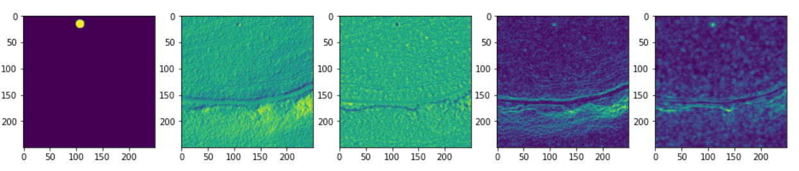

[](https://www.whiteboxgeo.com/manual/wbt_book/preface.html)
[](https://opensource.org/licenses/MIT)
[](https://twitter.com/william_lidberg)


# Cultural-remains
## Detect cultural remains from LiDAR data


# Table of  Contents

1. [Docker containers](#Docker-containers)
3. [Training data](#Training-data)
4. [Create digital elevation model](#Create-digital-elevation-model)
5. [Extract topographical features](#Extract-topographical-features)
6. [Semantic segmentation](#Semantic-segmentation)
    1. [Create segmentation masks](##Create-segmentation-mask)
    2. [Create image chips](##Create-image-chips)
    3. [Train U-net](##Train-U-net)
    4. [Evaluate U-net](##Evaluate-U-net)
    5. [Inference U-net](##Inference-U-net)
    6. [Post-processing U-net](##Post-processing-U-net)
7. [Object detection](#Object-detection)
    1. [Create bounding boxes](##Create-bounding-boxes)
    2. [Train YOLO](##Train-YOLO)
    3. [Evaluate YOLO](##Evaluate-YOLO)
    4. [Inference YOLO](##Inference-YOLO)
8. [Transfer learning](#Transfer-learning)
    1. [Data description](##Data-description)
    2. [Select craters](##Select-craters)
    3. [Craters to segmentation masks](##Craters-to-segmentation-masks)
    4. [Craters to bounding boxes](##Craters-to-bounding-boxes)
9. [References](#References)

***


# Docker containers

Navigate to respective dockerfile in the segmentation or object detection directories and build the containers

    docker build -t segmentation .
    docker build -t detection .

you can run the containers in the background with screen

    screen -S segmentation

    docker run -it -p 8888:8888 -p 16006:16006 --gpus all -v /mnt/Extension_100TB/William/GitHub/Remnants-of-charcoal-kilns:/workspace/code -v /mnt/Extension_100TB/William/Projects/Cultural_remains/data:/workspace/data -v /mnt/ramdisk:/workspace/temp -v /mnt/Extension_100TB/national_datasets/laserdataskog:/workspace/lidar segmentation:latest


**Start the notebook:**

    jupyter notebook --ip=0.0.0.0 --no-browser --allow-root

Copy the notebook link and then detach the screen environment with:

    ctlr + a + d

# Training data


# Create digital elevation model
The laser data contained 1-2 points / m2 and can be downloaded from Lantmäteriet: https://www.lantmateriet.se/en/geodata/geodata-products/product-list/laser-data-download-forest/

The Laser data is stored as .laz tiles where each tile is 2 500 m x 2 500 m
**Select lidar tiles based on locatiaon of training data**\
First pool all laz files in a single directory

    python /workspace/code/tools/pool_laz.py

Create a shapefile index of all laz tiles in the pooled directory

    python /workspace/code/tools/lidar_tile_footprint.py /workspace/lidar/pooled_laz_files/ /workspace/code/data/footprint.shp

Use the tile index and a shapefile of all field data to create a polygon that can be used to select and copy relevant laz tilesto a new directory

    python /workspace/code/tools/copy_laz_tiles.py /workspace/code/data/footprint.shp /workspace/code/data/cultural_remains.shp /workspace/lidar/pooled_laz_files/ /workspace/data/selected_lidar_tiles/

Finally use whitebox tools to create digital elevation models from the selected lidar data

    python /workspace/code/tools/laz_to_dem.py /workspace/data/selected_lidar_tiles/ /workspace/data/dem_tiles/ 0.5

## Extract and normalize topographical indices
The topographical data will be the same for both segmentation and object detection. All topographical indices are extracted using [Whitebox Tools](https://www.whiteboxgeo.com/manual/wbt_book/preface.html). The indices used are:  
    1. [Multidirectional hillshade]()  
    2. [Slope](https://www.whiteboxgeo.com/manual/wbt_book/available_tools/geomorphometric_analysis.html?highlight=slope#slope)  
    3. [High pass median filter](https://www.whiteboxgeo.com/manual/wbt_book/available_tools/image_processing_tools_filters.html?highlight=high%20pass%20meda#highpassmedianfilter)  
    4. [Spherical standard deviation of normals](https://www.whiteboxgeo.com/manual/wbt_book/available_tools/geomorphometric_analysis.html?highlight=circular#sphericalstddevofnormals)


This script extracts the topographical indices and normalizes them between 0 and 1.

    python /workspace/code/Extract_topographcical_indices.py /workspace/temp_dir/ /workspace/data/dem_tiles/ /workspace/data/topographical_indices_normalized/hillshade/ /workspace/data/topographical_indices_normalized/slope/ /workspace/data/topographical_indices_normalized/hpmf/ /workspace/data/topographical_indices_normalized/stdon/

# Semantic segmentation
Semantic segmentation uses masks where each pixel in the mask coresponds to a class. In our case the classes are:
0. Background values
1. Hunting pits
2. Charcoal kilns
3. 
4. 
5. 

The training data is stored as digitized polygons where each feature class is stored in the column named "class"
## Create segmentation masks
    python /workspace/code/semantic_segmentation/create_segmentation_masks.py /workspace/data/dem_tiles/ /workspace/code/data/cultural_remains.shp class /workspace/data/segmentation_masks/
## Create image chips

Split tiles into smaller image chips.
```diff
- Make sure the directory is empty/new so the split starts at 1 each time
```

    # Split hillshade
    python /workspace/code/tools/split_training_data.py /workspace/data/topographical_indices_normalized/hillshade/ /workspace/data/split_data/hillshade/ --tile_size 256

    # split slope
    python /workspace/code/tools/split_training_data.py /workspace/data/topographical_indices_normalized/slope/ /workspace/data/split_data/slope/ --tile_size 256

    # split high pass median filter
    python /workspace/code/tools/split_training_data.py /workspace/data/topographical_indices_normalized/hpmf/ /workspace/data/split_data/hpmf/ --tile_size 256

    # Spherical Std Dev Of Normals
    python /workspace/code/tools/split_training_data.py /workspace/data/topographical_indices_normalized/stdon/ /workspace/data/split_data/hpmf/ --tile_size 256

    # Split labels
    python /workspace/code/tools/split_training_data.py /workspace/data/segmentation_masks/ /workspace/data/split_data/labels/ --tile_size 256

**Remove chips without labels**

    python /workspace/code/tools/remove_unlabled_chips.py 1 /workspace/data/split_data/labels/ /workspace/data/split_data/hillshade/ /workspace/data/split_data/slope/ /workspace/data/split_data/hpmf/ /workspace/data/split_data/stdon/

Segmentation masks of charcoal kilns, hillshade, local slope, high pass median filter and standard deviation of normals


Segmentation masks of hunting pits, hillshade, local slope, high pass median filter and standard deviation of normals



## Train U-net
This is an example on how to train the model with one topographical indice:
    python /workspace/code/train.py -I /workspace/data/split_data/hillshade/ /workspace/data/split_data/labels/ /workspace/data/logfiles/log1/ --seed=40 --epochs 10

This is an example on how to train the model with all topographical indicies:
    python /workspace/code/train.py -I /workspace/data/split_data/hillshade/ -I /workspace/data/split_data/slope/ -I /workspace/data/split_data/hpmf/ -I /workspace/data/split_data/stdon/ /workspace/data/split_data/labels/ /workspace/data/logfiles/log1/ --seed=40 --epochs 10 
## Evaluate U-net
    python Y:/William/GitHub/Remnants-of-charcoal-kilns/inference.py Y:/William/Kolbottnar/data/topographical_indices/hillshade/ Y:/William/Kolbottnar/logs/log34/test.h5 D:/kolbottnar/inference/34_inference/ --tile_size=256 --wo_crf
## Inference U-net
    python Y:/William/GitHub/Remnants-of-charcoal-kilns/inference.py Y:/William/Kolbottnar/data/topographical_indices/hillshade/ Y:/William/Kolbottnar/logs/log34/test.h5 D:/kolbottnar/inference/34_inference/ --tile_size=256 --wo_crf
## Post-processing U-net
    python Y:/William/GitHub/Remnants-of-charcoal-kilns/post_processing.py D:/kolbottnar/inference/34_inference/ D:/kolbottnar/inference/34_post_processing/raw_polygons/ D:/kolbottnar/inference/34_post_processing/filtered_polygons/ --min_area=400 --min_ratio=-0.3
# Object detection

## Create bounding boxes

## Train YOLO

## Evaluate YOLO

## Inference YOLO

# Transfer learning


## Data description
Impact creaters from the moon were used to pre-train the model. These creaters were digitised by NASA and are avalible from the Moon Crater Database v1 Robbins:https://astrogeology.usgs.gov/search/map/Moon/Research/Craters/lunar_crater_database_robbins_2018 The database contains approximately 1.3 million lunar impact craters and is approximately complete for all craters larger than about 1–2 km in diameter. Craters were manually identified and measured on Lunar Reconnaissance Orbiter (LRO) Camera (LROC) Wide-Angle Camera (WAC) images, in LRO Lunar Orbiter Laser Altimeter (LOLA) topography, SELENE Kaguya Terrain Camera (TC) images, and a merged LOLA+TC DTM.


The Moon LRO LOLA DEM 118m v1 was used as digital elevation model. This digital elevation model  is based on data from the Lunar Orbiter Laser Altimeter, an instrument on the National Aeronautics and Space Agency (NASA) Lunar Reconnaissance Orbiter (LRO) spacecraft. The created DEM represents more than 6.5 billion measurements gathered between July 2009 and July 2013, adjusted for consistency in the coordinate system described below, and then converted to lunar radii.
Source: https://astrogeology.usgs.gov/search/details/Moon/LRO/LOLA/Lunar_LRO_LOLA_Global_LDEM_118m_Mar2014/cub

## Select craters
The charcoal kilns in the trainig data were between x and y pixels with an average of z in diameter. Therefore creaters that were less than x pixels (of the lundar dem) were excluded. creaters larger than y pixels were resampled down to z pixels. The following criterias:

    1. They can not overlap any nearby creaters.
    2. They have to be about the same size range as charcoal kilns in number of pixels.
    3. min and max lat and log values to avoid deformed craters?

## Craters to segmentation masks    

## Craters to bounding boxes

# Old notes


## Train model - test with hillshade only  
log 34 was trained on only hillshades and got mcc 0.85  
log 35 was trained on only hpmf and got mcc 0  
log 36 was trained on only slope and got mcc 0  

hpmf and slope did not work. normalise?  
log 42 was trained on normalized hillshade images. average mcc0.72 total mcc 0.84  
log44 was trained on normalised slope  
**train the model without CRF**  
    python Y:/William/GitHub/Remnants-of-charcoal-kilns/train.py Y:/William/Kolbottnar/data/selected_data/hillshade/ Y:/William/Kolbottnar/data/selected_data/labels/ Y:/William/Kolbottnar/logs/log42 XceptionUNet --seed=40 

hpmf  

    python Y:/William/GitHub/Remnants-of-charcoal-kilns/train.py Y:/William/Kolbottnar/data/selected_data/hpmf/ Y:/William/Kolbottnar/data/selected_data/labels/ Y:/William/Kolbottnar/logs/log43 XceptionUNet --seed=40 

## Evaluate model
    python Y:/William/GitHub/Remnants-of-charcoal-kilns/evaluate_model.py Y:/William/Kolbottnar/data/selected_data/hillshade/ Y:/William/Kolbottnar/data/selected_data/labels/ Y:/William/Kolbottnar/logs/log43/valid_imgs.txt Y:/William/Kolbottnar/logs/log43/test.h5 Y:/William/Kolbottnar/logs/log43/evaluation.csv --wo_crf

## Run inference
    python Y:/William/GitHub/Remnants-of-charcoal-kilns/inference.py Y:/William/Kolbottnar/data/topographical_indices/hillshade/ Y:/William/Kolbottnar/logs/log34/test.h5 D:/kolbottnar/inference/34_inference/ --tile_size=256 --wo_crf

## postprocessing
**min_area** is extracted from the smallest kiln in the training data.  
**min_ratio** is the perimeter to area ratio of the vector polygons. -0.3 is based on the training data.  

    python Y:/William/GitHub/Remnants-of-charcoal-kilns/post_processing.py D:/kolbottnar/inference/34_inference/ D:/kolbottnar/inference/34_post_processing/raw_polygons/ D:/kolbottnar/inference/34_post_processing/filtered_polygons/ --min_area=400 --min_ratio=-0.3
 
## contact information
Mail:
<William.lidberg@slu.se>\
Phone:
+46706295567\
[Twitter](https://twitter.com/william_lidberg)
## License
This project is licensed under the MIT License - see the LICENSE file for details.

# References