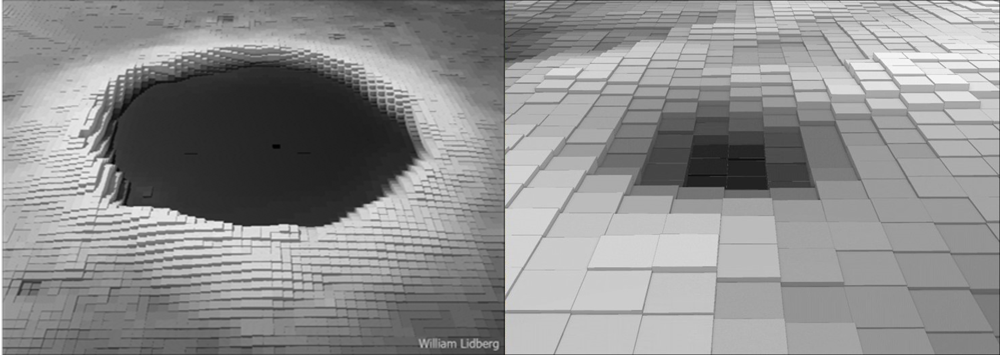
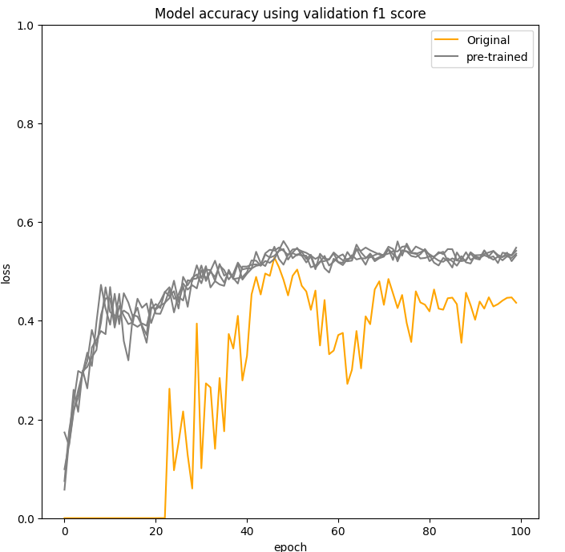
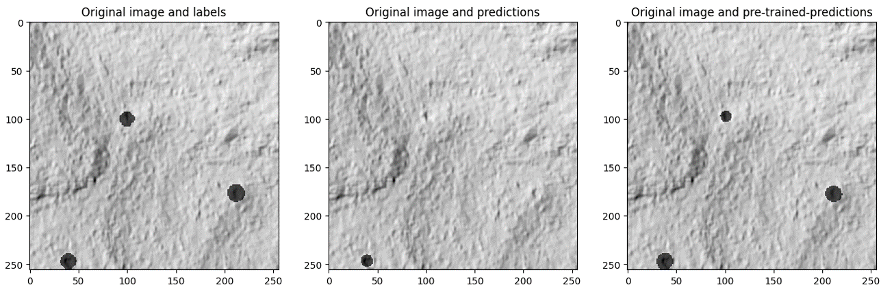
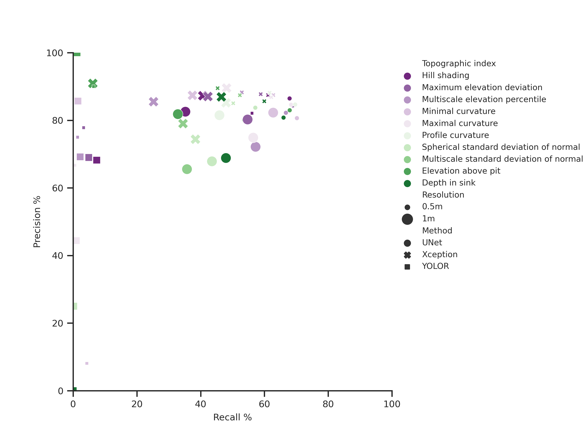

[](https://www.whiteboxgeo.com/manual/wbt_book/preface.html)
[](https://opensource.org/licenses/MIT)
[](https://twitter.com/william_lidberg)


# Detection-of-hunting-pits-using-LiDAR-and-deep-learning

You can pull this docker image and run the best model on your own data.
 
Pull xxxx

Docker run....

## AIM
The aim was to investigate whether hunting pits could be automatically mapped using Swedish national ALS data and deep learning. We also evaluated the performance of traditional topographical indices and multiple state-of-the-art topographical indices explicitly selected to enhance pit structures in high-resolution DEM data. 


\

# Table of  Contents

1. [Docker containers](#Docker-containers)
3. [Training and testing data](#Training-and-testing-data)
    1. [Create digital elevation model](##Create-digital-elevation-model)
    2. [Extract and normalize topographical indices](##Extract-and-normalize-topographical-indices)
    3. [Create segmentation masks](Create-segmentation-masks)
    4. [Create image chips](#Create-image-chips)
    5. [Create bounding boxes](#Create-bounding-boxes)
4. [Demonstration area](#Demonstration-area)
5. [Transfer learning with the moon](#Transfer-learning-with-the-moon)
    1. [Lunar data](#Lunar-data)
    2. [Create segmentation masks and bounding boxes from impact creaters](#Create-segmentation-masks-and-bounding-boxes-from-impact-creaters)
    3. [Extract and normalize topographical indices from the lunar DEM](#Extract-and-normalize-topographical-indices-from-the-lunar-DEM)
    4. [Train a UNnet on the moon](#Train-a-UNnet-on-the-moon)
6. [Semantic segmentation](#Semantic-segmentation)
    1. [Transfer learning and training](#Transfer-learning-and-training)
    2. [Evaluation on test data](#Evaluation-on-testdata)
    3. [Evaluation in the demonstration area](#Evaluation-in-the-demonstration-area)
7. [Object detection](#Object-detection)
    1. [Train YOLO](##Train-YOLO)
    2. [Evaluate YOLO](##Evaluate-YOLO)
    3. [Inference YOLO](##Inference-YOLO)
9. [Results](#Results)
    1. [Performance on test data](#Performance-on-test-data)
    2. [Performance in demonstration area](#Performance-in-demonstration-area)
10. [Acknowledgements](#Acknowledgements)
11. [Contact](#Contact)
12. [License](#License)
***


# Docker containers
Docker containers will be used to manage all envrionments in this project. Different images were used for segmentation and object detection

**Segmentation:** semantic_segmentation\Dockerfile

**Object detection:** object_detection\Dockerfile

Navigate to respective dockerfile in the segmentation or object detection directories and build the containers

    docker build -t segmentation .
    docker build -t detection .


**Run container**\
Note that this container was run on a multi instance GPU (A100). With a normal GPU replace --gpus device=0:0 with gpus all

    docker run -it --gpus device=0:0 -v /mnt/Extension_100TB/William/GitHub/Remnants-of-charcoal-kilns:/workspace/code -v /mnt/Extension_100TB/William/Projects/Cultural_remains/data:/workspace/data -v /mnt/Extension_100TB/national_datasets/laserdataskog/:/workspace/lidar segmentation:latest bash

        
There is also an option to run this container as a notebook. This was run on a server with port forwarding over VPN and SSH.


    docker run -it --rm -p 8882:8882 --gpus all -v /mnt/Extension_100TB/William/GitHub/Remnants-of-charcoal-kilns:/workspace/code -v /mnt/Extension_100TB/William/Projects/Cultural_remains/data:/workspace/data -v /mnt/Extension_100TB/national_datasets/laserdataskog/:/workspace/lidar segmentation:latest bash

    cd /workspace/code/notebooks/

    jupyter lab --ip=0.0.0.0 --port=8882 --allow-root --no-browser --NotebookApp.allow_origin='*'

    ssh -L 8881:localhost:8881 <IPADRESS_TO_SERVER>

# Training and testing data
The training data were collected from multiple sources. Historical forest maps from local archives where digitized and georeferenced. Open data from the [swedish national heritage board were downloaded and digitized](https://pub.raa.se/). All remains where referenced with the liDAR data in order to match the reported remain to the LiDAR data. In total 2519 hunting pits where manually digitized and corrected this way (figure 1a). A seperate demo area was also used for visual inspection (figure ab)

\
Figure 1: Locations of hunting pits used in this study. In total, 2519 hunting pits were manually mapped in northern Sweden. Some 80% of the hunting pits were used for training the models while 20% were used for testing. 


## Create digital elevation model
The laser data contained 1-2 points / m2 and can be downloaded from Lantmäteriet: https://www.lantmateriet.se/en/geodata/geodata-products/product-list/laser-data-download-forest/. The Laser data is stored as .laz tiles where each tile is 2 500 m x 2 500 m.

**Select lidar tiles based on location of training data**\
First pool all laz files in a single directory.

    python /workspace/code/tools/pool_laz.py

Then Create a shapefile tile index of all laz tiles in the pooled directory.

    python /workspace/code/tools/lidar_tile_footprint.py /workspace/lidar/pooled_laz_files/ /workspace/data/footprint.shp

Use the shapefile tile index and a shapefile of all field data to create a polygon that can be used to select and copy relevant laz tiles to a new directory.

    python /workspace/code/tools/copy_laz_tiles.py /workspace/data/footprint.shp /workspace/code/data/Hunting_pits_covered_by_lidar.shp /workspace/lidar/pooled_laz_files/ /workspace/data/selected_lidar_tiles_pits/

Create digital elevation models from the selected lidar data

    python /workspace/code/tools/laz_to_dem.py /workspace/data/selected_lidar_tiles_pits/ /workspace/data/dem_tiles_pits/ 0.5

    python /workspace/code/tools/laz_to_dem.py /workspace/data/selected_lidar_tiles_pits/ /workspace/data/dem_tiles_pits_1m/ 1.0

<br/>

## Extract and normalize topographical indices
Training a model directly on the digital elevation model is not practical since the values ranges from 0 to 2000 m. Instead different topographical indices were extracted from the DEM. The topographical data will be the same for both segmentation and object detection. All topographical indices are extracted using [Whitebox Tools](https://www.whiteboxgeo.com/manual/wbt_book/preface.html). The indices used are:  
*   [Multidirectionl hillshade](https://www.whiteboxgeo.com/manual/wbt_book/available_tools/geomorphometric_analysis.html?highlight=multidirec#multidirectionalhillshade)
*   [Max elevation Deviation](https://www.whiteboxgeo.com/manual/wbt_book/available_tools/geomorphometric_analysis.html?highlight=maxelevation#maxelevationdeviation)
*   [Multiscale Elevation Percentile](https://www.whiteboxgeo.com/manual/wbt_book/available_tools/geomorphometric_analysis.html?highlight=multiscale#multiscaleelevationpercentile)
*   [Min curvature](https://www.whiteboxgeo.com/manual/wbt_book/available_tools/geomorphometric_analysis.html?highlight=min%20curvature#minimalcurvature)
*   [Max curvature](https://www.whiteboxgeo.com/manual/wbt_book/available_tools/geomorphometric_analysis.html?highlight=max%20curvature#maximalcurvature)
*   [Profile curvature](https://www.whiteboxgeo.com/manual/wbt_book/available_tools/geomorphometric_analysis.html?highlight=profile#profilecurvature)
*   [Spherical Standard deviation of normals](https://www.whiteboxgeo.com/manual/wbt_book/available_tools/geomorphometric_analysis.html?highlight=min%20curvature#SphericalStdDevOfNormals)
*   [Multiscale standard deviation of normals](https://www.whiteboxgeo.com/manual/wbt_book/available_tools/geomorphometric_analysis.html?highlight=multiscale#multiscalestddevnormals)
*   [Elevation above pit](https://www.whiteboxgeo.com/manual/wbt_book/available_tools/geomorphometric_analysis.html?highlight=elevation%20above%20pit#elevabovepit)
*   [Depth In Sink](https://www.whiteboxgeo.com/manual/wbt_book/available_tools/hydrological_analysis.html?highlight=depth#depthinsink)


This script extracts the topographical indices and normalizes them between 0 and 1. This step takes around 30 seconds / tile. It would take about 26 days for Sweden on 0.5 m resolution.

    python /workspace/code/Extract_topographcical_indices_05m.py /workspace/temp/ /workspace/data/dem_tiles_pits/ /workspace/data/topographical_indices_normalized_pits/hillshade/ /workspace/data/topographical_indices_normalized_pits/maxelevationdeviation/ /workspace/data/topographical_indices_normalized_pits/multiscaleelevationpercentile/ /workspace/data/topographical_indices_normalized_pits/minimal_curvature/ /workspace/data/topographical_indices_normalized_pits/maximal_curvature/ /workspace/data/topographical_indices_normalized_pits/profile_curvature/ /workspace/data/topographical_indices_normalized_pits/stdon/ /workspace/data/topographical_indices_normalized_pits/multiscale_stdon/ /workspace/data/topographical_indices_normalized_pits/elevation_above_pit/ /workspace/data/topographical_indices_normalized_pits/depthinsink/

    python /workspace/code/Extract_topographcical_indices_1m.py /workspace/temp/ /workspace/data/dem_tiles_pits_1m/ /workspace/data/topographical_indices_normalized_pits_1m/hillshade/ /workspace/data/topographical_indices_normalized_pits_1m/maxelevationdeviation/ /workspace/data/topographical_indices_normalized_pits_1m/multiscaleelevationpercentile/ /workspace/data/topographical_indices_normalized_pits_1m/minimal_curvature/ /workspace/data/topographical_indices_normalized_pits_1m/maximal_curvature/ /workspace/data/topographical_indices_normalized_pits_1m/profile_curvature/ /workspace/data/topographical_indices_normalized_pits_1m/stdon/ /workspace/data/topographical_indices_normalized_pits_1m/multiscale_stdon/ /workspace/data/topographical_indices_normalized_pits_1m/elevation_above_pit/ /workspace/data/topographical_indices_normalized_pits_1m/depthinsink/

## Create segmentation masks

Semantic segmentation uses masks where each pixel in the mask coresponds to a class. In our case the classes are:

0. Background values
1. Hunting pits

The training data is stored as digitized polygons where each feature class is stored in the column named "classvalue". Note that only polygons overlapping a dem tile will be converted to a labeled tile. polygons outside of dem tiles are ignored.

    python /workspace/code/tools/create_segmentation_masks.py /workspace/data/dem_tiles_pits/ /workspace/code/data/Hunting_pit_polygons.shp Classvalue /workspace/data/segmentation_masks_pits_05m/

    python /workspace/code/tools/create_segmentation_masks.py /workspace/data/dem_tiles_pits_1m/ /workspace/code/data/Hunting_pit_polygons.shp Classvalue /workspace/data/segmentation_masks_pits_1m/
    
## Create image chips
Each of the 2.5km x 2.5km dem tiles were Split into smaller image chips with the size 256 x 256 pixels. This corresponds to 125m x 125m in with a 0.5m DEM resolution.
```diff
- Make sure the directory is empty/new so the split starts at 1 each time
```
python /workspace/code/tools/split_training_data.py /workspace/data/segmentation_masks_pits_1m/ /workspace/data/split_data_pits_1m/labels/ --tile_size 250

The bash script ./code/split_indices.sh will remove and create new directories and then run the splitting script on all indicies. Each 2.5 km x 2.5 km tile is split into image chips with the size 250 x 250 pixels.

    ./workspace/code/split_indices_05m.sh

    ./workspace/code/split_indices_1m.sh


## Create bounding boxes
Bounding boxes can be created from segmentation masks if each object has a uniqe ID. A different column in the shapefile was used to achive this : object_id. Run the "create_segmentation_mask.py script on this column.

**Create new segmentation masks with uniqe ID**


    python /workspace/code/tools/create_segmentation_masks.py /workspace/data/dem_tiles_pits/ /workspace/code/data/Hunting_pits_covered_by_lidar.shp object_id /workspace/data/object_detection/segmentation_masks_tiles_05m/
    python /workspace/code/tools/create_segmentation_masks.py /workspace/data/dem_tiles_pits_1m/ /workspace/code/data/Hunting_pits_covered_by_lidar.shp object_id /workspace/data/object_detection/segmentation_masks_tiles_1m/

**Split segmentation masks into chips**

    python /workspace/code/tools/split_training_data.py /workspace/data/object_detection/segmentation_masks_tiles_05m/ /workspace/data/object_detection/split_segmentations_masks_05m/ --tile_size 250
    python /workspace/code/tools/split_training_data.py /workspace/data/object_detection/segmentation_masks_tiles_1m/ /workspace/data/object_detection/split_segmentations_masks_1m/ --tile_size 250

**Convert selected segmentation masks to bounding boxes**

Use the object detection docker image to create bounding boxes.

    docker run -it --gpus all -v /mnt/Extension_100TB/William/GitHub/Remnants-of-charcoal-kilns:/workspace/code -v /mnt/Extension_100TB/William/Projects/Cultural_remains/data:/workspace/data -v /mnt/Extension_100TB/national_datasets/laserdataskog:/workspace/lidar detection:latest

    python /workspace/code/object_detection/masks_to_boxes.py /workspace/temp/ /workspace/data/object_detection/split_segmentations_masks_05m/ 250 0 /workspace/data/object_detection/bounding_boxes_05m/

    python /workspace/code/object_detection/masks_to_boxes.py /workspace/temp/ /workspace/data/object_detection/split_segmentations_masks_1m/ 250 0 /workspace/data/object_detection/bounding_boxes_1m/


**copy image chips and bounding boxes to the final directory**

    python /workspace/code/tools/copy_correct_chips.py /workspace/data/split_data_pits_05m/  /workspace/data/object_detection/bounding_boxes_05m/ /workspace/data/final_data_05m/training/

    python /workspace/code/tools/copy_correct_chips.py /workspace/data/split_data_pits_1m/  /workspace/data/object_detection/bounding_boxes_1m/ /workspace/data/final_data_1m/training/


**Create data split and move test data to new directories**\
create data split between training and testing using this script. The batch script partition_data.sh cleans the test data directories and moves the test chips to respective test directory using a 80% vs 20% train / test split. Run it with:
    
    ./partition_data_05m.sh
    ./partition_data_1m.sh

Figure 2 shows some examples of how one image chip in the training data looks. 
\
Figure 2: An example of one of the image chips used to train the deep learning models. Each topographical index was selected to highlight the local topography to make it easier for the deep learning model to learn how hunting pits appear in the LiDAR data. The segmentation mask was used as the label for the segmentation model, while the bounding boxes were used for the object detection model. The chips displayed here are from a DEM with 0.5 m resolution.

# Demonstration area
Extract dems
    python /workspace/code/tools/laz_to_dem.py /workspace/data/demo_area/tiles/ /workspace/data/demo_area/dem_tiles/ 0.5

    python /workspace/code/tools/laz_to_dem.py /workspace/data/demo_area/tiles/ /workspace/data/demo_area/dem_tiles_1m/ 1.0


**Calculate topographical indicies for demo area**

    python /workspace/code/Extract_topographcical_indices_05m.py /workspace/temp/ /workspace/data/demo_area/dem_tiles/ /workspace/data/demo_area/topographical_indicies_05m/hillshade/ /workspace/data/demo_area/topographical_indicies_05m/maxelevationdeviation/ /workspace/data/demo_area/topographical_indicies_05m/multiscaleelevationpercentile/ /workspace/data/demo_area/topographical_indicies_05m/minimal_curvature/ /workspace/data/demo_area/topographical_indicies_05m/maximal_curvature/ /workspace/data/demo_area/topographical_indicies_05m/profile_curvature/ /workspace/data/demo_area/topographical_indicies_05m/stdon/ /workspace/data/demo_area/topographical_indicies_05m/multiscale_stdon/ /workspace/data/demo_area/topographical_indicies_05m/elevation_above_pit/ /workspace/data/demo_area/topographical_indicies_05m/depthinsink/

    python /workspace/code/Extract_topographcical_indices_1m.py /workspace/temp/ /workspace/data/demo_area/dem_tiles_1m/ /workspace/data/demo_area/topographical_indicies_1m/hillshade/ /workspace/data/demo_area/topographical_indicies_1m/maxelevationdeviation/ /workspace/data/demo_area/topographical_indicies_1m/multiscaleelevationpercentile/ /workspace/data/demo_area/topographical_indicies_1m/minimal_curvature/ /workspace/data/demo_area/topographical_indicies_1m/maximal_curvature/ /workspace/data/demo_area/topographical_indicies_1m/profile_curvature/ /workspace/data/demo_area/topographical_indicies_1m/stdon/ /workspace/data/demo_area/topographical_indicies_1m/multiscale_stdon/ /workspace/data/demo_area/topographical_indicies_1m/elevation_above_pit/ /workspace/data/demo_area/topographical_indicies_1m/depthinsink/


# Transfer learning with the moon
 We chose to use impact craters on the lunar surface as a transfer learning strategy. The idea was that impact craters are pits in a lunar DEM, and so would be similar enough to hunting pits on Earth to give our models a better starting point than random initialized weights (figure 3). 
  
Figure 3: To the left is an example of how an impact creater looks in the data from the lunar orbiter and to the right is an example of how a hunting pit looks in the Swedish DEM.

## Lunar data
The craters were digitized by NASA and were available from the [Moon Crater Database v1](https://agupubs.onlinelibrary.wiley.com/doi/full/10.1029/2018JE005592). The database contained approximately 1.3 million lunar impact craters and were approximately complete for all craters larger than about 1–2 km in diameter. Craters were manually identified and measured with data from the Lunar Reconnaissance Orbiter. The Lunar Orbiter Laser Altimeter, which was located on the LRO spacecraft, was used to create a DEM of the moon with a resolution of 118 m

## Create segmentation masks and bounding boxes from impact creaters

The Lunar creaters were used to create a binary raster mask where 1 is a creater and 0 is background. Two segmentation masks were created. 1 for segmentation and 1 for object detection. The reason is that each creater needs a uniqe ID for the conversion to bounding boxes source:  
    
    python /workspace/code/tools/create_segmentation_masks.py /workspace/data/lunar_data/dem_lat_50/ /workspace/data/lunar_data/Catalog_Moon_Release_20180815_shapefile180/Catalog_Moon_Release_20180815_1kmPlus_180.shp Classvalue /workspace/data/lunar_data/topographical_indices_normalized/labels/

    python /workspace/code/tools/create_segmentation_masks.py /workspace/data/lunar_data/dem_lat_50/ /workspace/data/lunar_data/Catalog_Moon_Release_20180815_shapefile180/Catalog_Moon_Release_20180815_1kmPlus_180.shp FID /workspace/data/lunar_data/topographical_indices_normalized/object_labels/

## Extract and normalize topographical indices from the lunar DEM
**Extract topographical indices**\
The same topographical indices described above were extracted from the lunar DEM.

    python /workspace/code/Extract_topographcical_indices_05m.py /workspace/temp/ /workspace/data/lunar_data/dem_lat_50/ /workspace/data/lunar_data/topographical_indices_normalized/hillshade/ /workspace/data/lunar_data/topographical_indices_normalized/maxelevationdeviation/ /workspace/data/lunar_data/topographical_indices_normalized/multiscaleelevationpercentile/ /workspace/data/lunar_data/topographical_indices_normalized/minimal_curvature/ /workspace/data/lunar_data/topographical_indices_normalized/maximal_curvature/ /workspace/data/lunar_data/topographical_indices_normalized/profile_curvature/ /workspace/data/lunar_data/topographical_indices_normalized/stdon/ /workspace/data/lunar_data/topographical_indices_normalized/multiscale_stdon/ /workspace/data/lunar_data/topographical_indices_normalized/elevation_above_pits/ /workspace/data/lunar_data/topographical_indices_normalized/depthinsink/

**Split lunar data into image chips**

    ./workspace/code/split_indicies_moon.sh

    ./code/partition_data_moon.sh

## Train a UNnet on the moon
-p 8888:8888 --mount type=bind,src=G:\moon\code,target=/workspace/code --mount type=bind,src=G:\moon\data,target=/workspace/data segmentation:latest
    docker run -it --gpus all --mount type=bind,src=G:\moon\code,target=/workspace/code --mount type=bind,src=G:\moon\data,target=/workspace/data segmentation:latest


    python /workspace/code/semantic_segmentation/train_unet.py -I /workspace/data/lunar_data/final_data/training/maximal_curvature/ /workspace/data/lunar_data/final_data/training/labels/ /workspace/data/logfiles/moon/ --weighting="mfb" --depth=4 --epochs=100 --batch_size=128 --classes=0,1
    python /workspace/code/semantic_segmentation/evaluate_unet.py -I /workspace/data/final_data_05m/testing/maximal_curvature/ /workspace/data/final_data_05m/testing/labels/ /workspace/data/logfiles/moon/trained.h5 /workspace/data/logfiles/moon/test.csv --classes=0,1 --depth=4

    ./workspace/code/semantic_segmentation/train_test_unet_moon.sh

**Convert selected segmentation masks to bounding boxes**

Just like before we used the object detection docker image to create bounding boxes.

    docker run -it --gpus all -v /mnt/Extension_100TB/William/GitHub/Remnants-of-charcoal-kilns:/workspace/code -v /mnt/Extension_100TB/William/Projects/Cultural_remains/data:/workspace/data -v /mnt/Extension_100TB/national_datasets/laserdataskog:/workspace/lidar detection:latest bash

    python /workspace/code/object_detection/masks_to_boxes.py /workspace/temp/ /workspace/data/lunar_data/split_data/object_labels/ 250 0 /workspace/data/lunar_data/bounding_boxes/

    python /workspace/code/tools/copy_correct_chips.py /workspace/data/lunar_data/split_data/ /workspace/data/lunar_data/bounding_boxes/ /workspace/data/lunar_data/final_data/training/
# Semantic segmentation
We used TensorFlow 2.6 to build two types of encoder-decoder style deep neural networks to transform the topographical indices into images highlighting the detected hunting pits. On the encoding path, the networks learn a series of filters, organized in layers, which express larger and larger neighbourhoods of pixels in fewer and fewer vectors of features. This downsampling forces the networks to ignore noise and extract features relevant for hunting pit detection. In addition to this regular U-net, which applies a filter to all feature vectors in a specific spatial neighbourhood at once, we also used a U-net with Xception blocks (Chollet, 2017) which we refer to as Xception UNet
## Transfer learning and training
The training and evaluation of test chips were done with these batch scripts:

        ./Pre_train_UNets_with_the_moon.sh
        ./train_test_unet_05m.sh
        ./train_test_unet_1m.sh
        ./train_test_xception_unet_05m.sh
        ./train_test_xception_unet_1m.sh

Transfer learning improved the stability of the models and increased the accuracy. Here is an example of how the F1 score between the original model and some pre-trained modeles using different seeds.

 

Transfer learning improved the result for all UNet models.
 

## Evaluation on test data
Since we are interested in detecting hunting pits not pixels the evaluation was done on an object basis instead of pixel by pixel. The detected pixels were converted to polygons and then intersected with hunting pits. 

    python /workspace/code/semantic_segmentation/evlaute_as_objects.py /workspace/data/final_data_05m/testing/polygon_labels/ /workspace/data/final_data_05m/testing/inference_XceptionUNet/05m/inference_polygon/minimal_curvature/ 

## Evaluation in the demonstration area
The best models for each resolution were used to map hunting pits in a demonstration area in northern Sweden where 80 hunting pits had been mapped manually. This was done in order to inspect the results visually in addition to the statistical metrics from the test data. 

**Inference using the best indices**


    time python /workspace/code/semantic_segmentation/inference_unet.py -I /workspace/data/demo_area/topographical_indicies_05m/minimal_curvature /workspace/data/logfiles/UNet/05m/minimal_curvature1/trained.h5 /workspace/data/demo_area/topographical_indicies_05m/inference/ UNet --classes 0,1 --tile_size 250
    time python /workspace/code/semantic_segmentation/inference_unet.py -I /workspace/data/demo_area/topographical_indicies_1m/minimal_curvature /workspace/data/logfiles/UNet/1m/minimal_curvature1/trained.h5 /workspace/data/demo_area/topographical_indicies_1m/inference/ UNet --classes 0,1 --tile_size 250

    time python /workspace/code/semantic_segmentation/inference_unet.py -I /workspace/data/demo_area/topographical_indicies_05m/maximal_curvature /workspace/data/logfiles/ExceptionUNet/05m/maximal_curvature1/trained.h5 /workspace/data/demo_area/topographical_indicies_05m/inference_exception/ XceptionUNet --classes 0,1 --tile_size 250
    time python /workspace/code/semantic_segmentation/inference_unet.py -I /workspace/data/demo_area/topographical_indicies_1m/profile_curvature /workspace/data/logfiles/ExceptionUNet/1m/profile_curvature1/trained.h5 /workspace/data/demo_area/topographical_indicies_1m/inference_exception/ XceptionUNet --classes 0,1 --tile_size 250     

**convert test labels to polygon**
    Y:\William\GitHub\Remnants-of-charcoal-kilns\tools\labels_to_polygons.py

**convert test predictions to polygon**

    python /workspace/code/semantic_segmentation/post_processing.py /workspace/temp/ /workspace/data/demo_area/topographical_indicies_05m/inference_exception/ /workspace/data/demo_area/topographical_indicies_05m/inference_exception_post_processed/ --output_type=polygon --min_area=30 --min_ratio=-1
    python /workspace/code/semantic_segmentation/post_processing.py /workspace/temp/ /workspace/data/demo_area/topographical_indicies_1m/inference_exception/ /workspace/data/demo_area/topographical_indicies_1m/inference_exception_post_processed/ --output_type=polygon --min_area=30 --min_ratio=-1


# Object detection

## Train YOLO

## Evaluate YOLO

## Inference YOLO


# Results
Three deep learning architectures were evaluated for 10 different topographical indices extracted from DEMs with two resolutions. The U-net model trained on the topographical index profile curvature from a 0.5 m DEM was the most accurate method with an F1 score of 0.76. This method was able to map 70% of all hunting pits and had a false positive rate of 15% when evaluated on the test data.

  

## Performance on test data
The evaluation was carried out in two parts. First, the performance using the 20% test data that had been set aside was assessed. Second, the best combination of DEM resolution and topographical index was applied to a separate demonstration area for visual inspection. The models that were trained on topographical indices from a 0.5m DEM were more accurate than models trained on topographical indices from a 1 m DEM, shown as higher recall and precision in Figure 4. 

## Performance in demonstration area


# Acknowledgements
We thank the Swedish forest agency for digitizing part of the hunting pits used in this study. This work was partially supported by the Wallenberg AI, Autonomous Systems and Software Program – Humanities and Society (WASP-HS) funded by the Marianne and Marcus Wallenberg Foundation, the Marcus and Amalia Wallenberg Foundation, KEMPE and the Swedish forest agency.

# Contact information
Mail:
<William.lidberg@slu.se> and <William.lidberg@gmail.com>\
Phone:
+46706295567\
[Twitter](https://twitter.com/william_lidberg)
# License
This project is licensed under the MIT License - see the LICENSE file for details.


