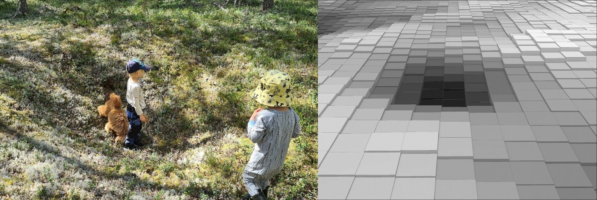

[](https://www.whiteboxgeo.com/manual/wbt_book/preface.html)
[](https://opensource.org/licenses/MIT)
[](https://twitter.com/william_lidberg)


# Cultural-remains
## AIM
The aim of this project is to evaluate methods to automatically detect trapping pits using remote sensing. Two machine learning methods will be tested on multiple topographical indices extracted from LiDAR data. 


# Table of  Contents

1. [Docker containers](#Docker-containers)
3. [Training data](#Training-data)
4. [Create digital elevation model](#Create-digital-elevation-model)
5. [Extract and normalize topographical indices](#Extract-and-normalize-topographical-indices)
6. [Semantic segmentation](#Semantic-segmentation)
    1. [Create segmentation masks](##Create-segmentation-mask)
    2. [Create image chips](##Create-image-chips)
    3. [Train U-net](##Train-U-net)
    4. [Evaluate U-net](##Evaluate-U-net)
    5. [Inference U-net](##Inference-U-net)
    6. [Post-processing U-net](##Post-processing-U-net)
7. [Object detection](#Object-detection)
    1. [Create bounding boxes](##Create-bounding-boxes)
    2. [Train YOLO](##Train-YOLO)
    3. [Evaluate YOLO](##Evaluate-YOLO)
    4. [Inference YOLO](##Inference-YOLO)
8. [Transfer learning](#Transfer-learning)
    1. [Data description](##Data-description)
    2. [Select craters](##Select-craters)
    3. [Craters to segmentation masks](##Craters-to-segmentation-masks)
    4. [Craters to bounding boxes](##Craters-to-bounding-boxes)
9. [References](#References)

***


# Docker containers
Docker containers will be used to manage all envrionments in this project. Different images were used for segmentation and object detection\
**Segmentation:**

**Object detection:**

Navigate to respective dockerfile in the segmentation or object detection directories and build the containers

    docker build -t segmentation .
    docker build -t detection .
    docker build -t detection https://github.com/williamlidberg/Cultural-remains.git#main:object_detection

You can run the container in the background with screen

    screen -S segmentation

    docker run -it --gpus all -v /mnt/Extension_100TB/William/GitHub/Remnants-of-charcoal-kilns:/workspace/code -v /mnt/Extension_100TB/William/Projects/Cultural_remains/data:/workspace/data -v /mnt/ramdisk:/workspace/temp -v /mnt/Extension_100TB/national_datasets/laserdataskog:/workspace/lidar segmentation:latest


# Training data
The training data were collected from multiple sources. Historical forest maps from local archives where digitized and georeferenced. Open data from the [swedish national heritage board were downloaded and digitized](https://pub.raa.se/). All remains where referenced with the liDAR data in order to match the reported remain to the LiDAR data. In total x hunting pits where manually digitized and corrected this way.

# Create digital elevation model
The laser data contained 1-2 points / m2 and can be downloaded from Lantmäteriet: https://www.lantmateriet.se/en/geodata/geodata-products/product-list/laser-data-download-forest/. The Laser data is stored as .laz tiles where each tile is 2 500 m x 2 500 m

**Select lidar tiles based on locatiaon of training data**\
First pool all laz files in a single directory

    python /workspace/code/tools/pool_laz.py

Then Create a shapefile tile index of all laz tiles in the pooled directory

    python /workspace/code/tools/lidar_tile_footprint.py /workspace/lidar/pooled_laz_files/ /workspace/data/footprint.shp

Use the shapefile tile index and a shapefile of all field data to create a polygon that can be used to select and copy relevant laz tilesto a new directory

    python /workspace/code/tools/copy_laz_tiles.py /workspace/data/footprint.shp /workspace/code/Hunting_pits_covered_by_lidar.shp /workspace/lidar/pooled_laz_files/ /workspace/data/selected_lidar_tiles_pits/

Finally use whitebox tools to create digital elevation models from the selected lidar data
**Training and testing areas**
    python /workspace/code/tools/laz_to_dem.py /workspace/data/selected_lidar_tiles_pits/ /workspace/data/dem_tiles_pits/ 0.5


## Extract and normalize topographical indices
Training a model directly on the digital elevation model is not practical since the values ranges from 0 to 2000 m. Instead different topographical indices were extracted from the DEM. The topographical data will be the same for both segmentation and object detection. All topographical indices are extracted using [Whitebox Tools](https://www.whiteboxgeo.com/manual/wbt_book/preface.html). The indices used are:  
*   [Multidirectionl hillshade](https://www.whiteboxgeo.com/manual/wbt_book/available_tools/geomorphometric_analysis.html?highlight=multidirec#multidirectionalhillshade)
*   [Max elevation Deviation](https://www.whiteboxgeo.com/manual/wbt_book/available_tools/geomorphometric_analysis.html?highlight=maxelevation#maxelevationdeviation)
*   [Multiscale Elevation Percentile](https://www.whiteboxgeo.com/manual/wbt_book/available_tools/geomorphometric_analysis.html?highlight=multiscale#multiscaleelevationpercentile)
*   [Min curvature](https://www.whiteboxgeo.com/manual/wbt_book/available_tools/geomorphometric_analysis.html?highlight=min%20curvature#minimalcurvature)
*   [Max curvature](https://www.whiteboxgeo.com/manual/wbt_book/available_tools/geomorphometric_analysis.html?highlight=max%20curvature#maximalcurvature)
*   [Profile curvature](https://www.whiteboxgeo.com/manual/wbt_book/available_tools/geomorphometric_analysis.html?highlight=profile#profilecurvature)
*   [Spherical Standard deviation of normals](https://www.whiteboxgeo.com/manual/wbt_book/available_tools/geomorphometric_analysis.html?highlight=min%20curvature#SphericalStdDevOfNormals)
*   [Multiscale standard deviation of normals](https://www.whiteboxgeo.com/manual/wbt_book/available_tools/geomorphometric_analysis.html?highlight=multiscale#multiscalestddevnormals)
*   [Elevation above pit](https://www.whiteboxgeo.com/manual/wbt_book/available_tools/geomorphometric_analysis.html?highlight=elevation%20above%20pit#elevabovepit)
*   [Depth In Sink](https://www.whiteboxgeo.com/manual/wbt_book/available_tools/hydrological_analysis.html?highlight=depth#depthinsink)


This script extracts the topographical indices and normalizes them between 0 and 1. This step takes around 30 seconds / tile. It would take about 26 days for Sweden.

    python /workspace/code/Extract_topographcical_indices.py /workspace/temp/ /workspace/data/dem_tiles_pits/ /workspace/data/topographical_indices_normalized_pits/hillshade/ /workspace/data/topographical_indices_normalized_pits/maxelevationdeviation/ /workspace/data/topographical_indices_normalized_pits/multiscaleelevationpercentile/ /workspace/data/topographical_indices_normalized_pits/minimal_curvature/ /workspace/data/topographical_indices_normalized_pits/maximal_curvature/ /workspace/data/topographical_indices_normalized_pits/profile_curvature/ /workspace/data/topographical_indices_normalized_pits/stdon/ /workspace/data/topographical_indices_normalized_pits/multiscale_stdon/ /workspace/data/topographical_indices_normalized_pits/elevation_above_pit/ /workspace/data/topographical_indices_normalized_pits/depthinsink/
    
    real    105m27.086s
    user    1293m36.302s
    sys     89m0.528s


\
Distribution of the normalised topographical indices from one tile.

# Semantic segmentation
Semantic segmentation uses masks where each pixel in the mask coresponds to a class. In our case the classes are:

0. Background values
1. Hunting pits

    python /workspace/code/tools/count_labeled_pixels.py /workspace/data/segmentation_masks_pits/ 

\
The left image is a hunting pit (kids for scale) and the right image is the same hunting pit in the digital elevation model.


## Create segmentation masks
The training data is stored as digitized polygons where each feature class is stored in the column named "classvalue". Note that only polygons overlapping a dem tile will be converted to a labeled tile. polygons outside of dem tiles are ignored.

    python /workspace/code/tools/create_segmentation_masks.py /workspace/data/dem_tiles_pits/ /workspace/data/remains_pits.shp Classvalue /workspace/data/segmentation_masks_pits/
    
## Create image chips
Each of the 2.5km x 2.5km dem tiles were Split into smaller image chips with the size 250 x 250 pixels. This corresponds to 125m x 125m in with a 0.5m DEM resolution.
```diff
- Make sure the directory is empty/new so the split starts at 1 each time
```
The bash script ./code/split_indices.sh will remove and create new directories and then run the splitting script on all indicies. Each 2.5 km x 2.5 km tile is split into image chips with the size 250 x 250 pixels.

    ./code/split_indices.sh


**Remove chips without labels**\
image chips with less than four labeled pixels were removed. The minimum value is 4 pixels. The reason for using 4 pixels is that the bounding box courdinates can not be identical. For this reason objects smaller than one square meter have to be excluded. A larger threshold will remove along the boarder that are only partly on a chip. 

    python /workspace/code/tools/remove_unlabled_chips.py 4 /workspace/data/split_data_pits/labels/ /workspace/data/split_data_pits/hillshade/ /workspace/data/split_data_pits/elevation_above_pit/ /workspace/data/split_data_pits/stdon/ /workspace/data/split_data_pits/minimal_curvature/ /workspace/data/split_data_pits/profile_curvature/ /workspace/data/split_data_pits/maxelevationdeviation/ /workspace/data/split_data_pits/multiscaleelevationpercentile/ /workspace/data/split_data_pits/depthinsink/ /workspace/data/split_data_pits/multiscale_stdon/ /workspace/data/split_data_pits/maximal_curvature/

**count labeled pixels**
    python /workspace/code/tools/count_labeled_pixels.py /workspace/data/split_data_pits/labels/

1.16 % of all pixles in the chips are labaled as hunting pits. Try to use this to set weights to 0.16 

## Split data into training and testing data
The image chips were split into training data and testing data. 80% of the image chips were used for training the model and 20% were used for testing the model.

**Create data split and move test data to new directories**
The batch script partition_data.sh cleans the test data directories and moves the test chips to respective test directory using the split created above. Run it with ./code/partition_data.sh 
    
    ./code/partition_data.sh


# Train and evaluate Unet on individual indicies

**Hillshade**
run batchscript with ./code/train_test_unet.sh

    mkdir /workspace/data/logfiles/pits/hillshade5/
    python /workspace/code/semantic_segmentation/train_unet.py -I /workspace/data/split_data_pits/hillshade/ /workspace/data/split_data_pits/labels/ /workspace/data/logfiles/pits/hillshade5/ --weighting="0.01,1" --seed=40 --epochs 100 --batch_size=4

    python /workspace/code/semantic_segmentation/evaluate_unet.py -I /workspace/data/split_data_pits/hillshade/ /workspace/data/split_data_pits/labels/ /workspace/data/logfiles/pits/hillshade5/trained.h5 /workspace/data/logfiles/pits/hillshade5/eval.csv --selected_imgs=/workspace/data/logfiles/pits/hillshade5/valid_imgs.txt --classes=0,1
**Maximum elevation deviation**

**Multiscale elevation percentile**

**Minimal curvature**

**Maximal curvature** 

**Profile curvature**

**Spherical standard deviation of normal**

    mkdir /workspace/data/logfiles/pits/stdon1/
    python /workspace/code/semantic_segmentation/train_unet.py -I /workspace/data/split_data_pits/stdon/ /workspace/data/split_data_pits/labels/ /workspace/data/logfiles/pits/stdon1/ --weighting="0.01,1" --seed=40 --epochs 100 --batch_size=4
    python /workspace/code/semantic_segmentation/evaluate_unet.py -I /workspace/data/split_data_pits/stdon/ /workspace/data/split_data_pits/labels/ /workspace/data/logfiles/pits/stdon1/trained.h5 /workspace/data/logfiles/pits/stdon1/eval.csv --selected_imgs=/workspace/data/logfiles/pits/stdon1/valid_imgs.txt --classes=0,1

**Multiscale standard deviation of normal**

**Elevation above pit**

    mkdir /workspace/data/logfiles/pits/elevation_above_pit1/
    python /workspace/code/semantic_segmentation/train_unet.py -I /workspace/data/split_data_pits/elevation_above_pit/ /workspace/data/split_data_pits/labels/ /workspace/data/logfiles/pits/elevation_above_pit1/ --weighting="0.01,1" --seed=40 --epochs 100 --batch_size=4
    python /workspace/code/semantic_segmentation/evaluate_unet.py -I /workspace/data/split_data_pits/elevation_above_pit/ /workspace/data/split_data_pits/labels/ /workspace/data/logfiles/pits/elevation_above_pit1/trained.h5 /workspace/data/logfiles/pits/elevation_above_pit1/eval.csv --selected_imgs=/workspace/data/logfiles/pits/elevation_above_pit1/valid_imgs.txt --classes=0,1


**Depth in sink**


# Train U-net on multiple indicies
This is an example on how to train the model with all topographical indices:

    python /workspace/code/semantic_segmentation/train_unet.py -I /workspace/data/split_data_pits/hillshade/ -I /workspace/data/split_data_pits/maxelevationdeviation/ -I /workspace/data/split_data_pits/multiscaleelevationpercentile/ -I /workspace/data/split_data_pits/minimal_curvature/ -I /workspace/data/split_data_pits/maximal_curvature/ -I /workspace/data/split_data_pits/profile_curvature/ -I /workspace/data/split_data_pits/stdon/ -I /workspace/data/split_data_pits/multiscale_stdon/ -I /workspace/data/split_data_pits/elevation_above_pit/ -I /workspace/data/split_data_pits/depthinsink/ /workspace/data/split_data_pits/labels/ /workspace/data/logfiles/pits/everything1/ --weighting="0.01,1" --seed=40 --epochs 100

Evaluate

    python /workspace/code/semantic_segmentation/evaluate_unet.py -I /workspace/data/split_data_pits/hillshade/ -I /workspace/data/split_data_pits/maxelevationdeviation/ -I /workspace/data/split_data_pits/multiscaleelevationpercentile/ -I /workspace/data/split_data_pits/minimal_curvature/ -I /workspace/data/split_data_pits/maximal_curvature/ -I /workspace/data/split_data_pits/profile_curvature/ -I /workspace/data/split_data_pits/stdon/ -I /workspace/data/split_data_pits/multiscale_stdon/ -I /workspace/data/split_data_pits/elevation_above_pit/ -I /workspace/data/split_data_pits/depthinsink/ /workspace/data/split_data_pits/labels/ /workspace/data/logfiles/pits/everything1/trained.h5 /workspace/data/logfiles/pits/everything1/eval.csv --selected_imgs=/workspace/data/logfiles/pits/everything1/valid_imgs.txt --classes=0,1
    
Train using weights based on real distribution (0.016)
    python /workspace/code/semantic_segmentation/train_unet.py -I /workspace/data/split_data_pits/hillshade/ -I /workspace/data/split_data_pits/maxelevationdeviation/ -I /workspace/data/split_data_pits/multiscaleelevationpercentile/ -I /workspace/data/split_data_pits/minimal_curvature/ -I /workspace/data/split_data_pits/maximal_curvature/ -I /workspace/data/split_data_pits/profile_curvature/ -I /workspace/data/split_data_pits/stdon/ -I /workspace/data/split_data_pits/multiscale_stdon/ -I /workspace/data/split_data_pits/elevation_above_pit/ -I /workspace/data/split_data_pits/depthinsink/ /workspace/data/split_data_pits/labels/ /workspace/data/logfiles/pits/everything2/ --weighting="0.016,1" --seed=40 --epochs 100


Evaluate 2

    python /workspace/code/semantic_segmentation/evaluate_unet.py -I /workspace/data/split_data_pits/hillshade/ -I /workspace/data/split_data_pits/maxelevationdeviation/ -I /workspace/data/split_data_pits/multiscaleelevationpercentile/ -I /workspace/data/split_data_pits/minimal_curvature/ -I /workspace/data/split_data_pits/maximal_curvature/ -I /workspace/data/split_data_pits/profile_curvature/ -I /workspace/data/split_data_pits/stdon/ -I /workspace/data/split_data_pits/multiscale_stdon/ -I /workspace/data/split_data_pits/elevation_above_pit/ -I /workspace/data/split_data_pits/depthinsink/ /workspace/data/split_data_pits/labels/ /workspace/data/logfiles/pits/everything2/trained.h5 /workspace/data/logfiles/pits/everything2/eval.csv --selected_imgs=/workspace/data/logfiles/pits/everything2/valid_imgs.txt --classes=0,1


without depthinsink AND MULTISCALEELEVATIONPERCENTILE


    python /workspace/code/semantic_segmentation/train_unet.py -I /workspace/data/split_data_pits/hillshade/ -I /workspace/data/split_data_pits/elevation_above_pit/ -I /workspace/data/split_data_pits/stdon/ -I /workspace/data/split_data_pits/minimal_curvature/ -I /workspace/data/split_data_pits/profile_curvature/ -I /workspace/data/split_data_pits/maxelevationdeviation/ -I /workspace/data/split_data_pits/depthinsink/ /workspace/data/split_data_pits/labels/ /workspace/data/logfiles/pits/pits1/ --weighting="0.01,1" --seed=40 --epochs 100 

without MULTISCALEELEVATIONPERCENTILE batch size 16

    python /workspace/code/semantic_segmentation/train_unet.py -I /workspace/data/split_data_pits/hillshade/ -I /workspace/data/split_data_pits/elevation_above_pit/ -I /workspace/data/split_data_pits/stdon/ -I /workspace/data/split_data_pits/minimal_curvature/ -I /workspace/data/split_data_pits/profile_curvature/ -I /workspace/data/split_data_pits/maxelevationdeviation/ -I /workspace/data/split_data_pits/depthinsink/ /workspace/data/split_data_pits/labels/ /workspace/data/logfiles/pits/pits14/ --weighting="0.01,1" --seed=40 --epochs 100 --batch_size=16

without MULTISCALEELEVATIONPERCENTILE batch size 4 weights real

    python /workspace/code/semantic_segmentation/train_unet.py -I /workspace/data/split_data_pits/hillshade/ -I /workspace/data/split_data_pits/elevation_above_pit/ -I /workspace/data/split_data_pits/stdon/ -I /workspace/data/split_data_pits/minimal_curvature/ -I /workspace/data/split_data_pits/profile_curvature/ -I /workspace/data/split_data_pits/maxelevationdeviation/ -I /workspace/data/split_data_pits/depthinsink/ /workspace/data/split_data_pits/labels/ /workspace/data/logfiles/pits/pits15/ --weighting="0.002,1" --seed=40 --epochs 100 --batch_size=4


## Evaluate U-net
    python /workspace/code/semantic_segmentation/evaluate_unet.py -I /workspace/data/split_data_pits/hillshade/ -I /workspace/data/split_data_pits/elevation_above_pit/ -I /workspace/data/split_data_pits/stdon/ -I /workspace/data/split_data_pits/minimal_curvature/ -I /workspace/data/split_data_pits/profile_curvature/ -I /workspace/data/split_data_pits/maxelevationdeviation/ -I /workspace/data/split_data_pits/multiscaleelevationpercentile/ -I /workspace/data/split_data_pits/depthinsink/ /workspace/data/split_data_pits/labels/ /workspace/data/logfiles/pits/pits9/trained.h5 /workspace/data/logfiles/pits/pits11/eval.csv --selected_imgs=/workspace/data/logfiles/pits/pits11/valid_imgs.txt --classes=0,1
 
EVAL WITHOUT DEPTINSINK AND MULTISCALEELEVATIONPERCENTILE

    python /workspace/code/semantic_segmentation/evaluate_unet.py -I /workspace/data/split_data_pits/hillshade/ -I /workspace/data/split_data_pits/elevation_above_pit/ -I /workspace/data/split_data_pits/stdon/ -I /workspace/data/split_data_pits/minimal_curvature/ -I /workspace/data/split_data_pits/profile_curvature/ -I /workspace/data/split_data_pits/maxelevationdeviation/ /workspace/data/split_data_pits/labels/ /workspace/data/logfiles/pits/pits12/trained.h5 /workspace/data/logfiles/pits/pits12/eval.csv --selected_imgs=/workspace/data/logfiles/pits/pits12/valid_imgs.txt --classes=0,1

without MULTISCALEELEVATIONPERCENTILE batch size 4 good

    python /workspace/code/semantic_segmentation/evaluate_unet.py -I /workspace/data/split_data_pits/hillshade/ -I /workspace/data/split_data_pits/elevation_above_pit/ -I /workspace/data/split_data_pits/stdon/ -I /workspace/data/split_data_pits/minimal_curvature/ -I /workspace/data/split_data_pits/profile_curvature/ -I /workspace/data/split_data_pits/maxelevationdeviation/ -I /workspace/data/split_data_pits/depthinsink/ /workspace/data/split_data_pits/labels/ /workspace/data/logfiles/pits/pits13/trained.h5 /workspace/data/logfiles/pits/pits13/eval.csv --selected_imgs=/workspace/data/logfiles/pits/pits13/valid_imgs.txt --classes=0,1

without MULTISCALEELEVATIONPERCENTILE batch size 4 weights real

    python /workspace/code/semantic_segmentation/evaluate_unet.py -I /workspace/data/split_data_pits/hillshade/ -I /workspace/data/split_data_pits/elevation_above_pit/ -I /workspace/data/split_data_pits/stdon/ -I /workspace/data/split_data_pits/minimal_curvature/ -I /workspace/data/split_data_pits/profile_curvature/ -I /workspace/data/split_data_pits/maxelevationdeviation/ -I /workspace/data/split_data_pits/depthinsink/ /workspace/data/split_data_pits/labels/ /workspace/data/logfiles/pits/pits15/trained.h5 /workspace/data/logfiles/pits/pits15/eval.csv --selected_imgs=/workspace/data/logfiles/pits/pits15/valid_imgs.txt --classes=0,1


## Inference U-net on test chips
    python /workspace/code/semantic_segmentation/inference_unet.py -I /workspace/data/test_data_pits/hillshade/ -I /workspace/data/test_data_pits/maxelevationdeviation/ -I /workspace/data/test_data_pits/multiscaleelevationpercentile/ -I /workspace/data/test_data_pits/minimal_curvature/ -I /workspace/data/test_data_pits/maximal_curvature/ -I /workspace/data/test_data_pits/profile_curvature/ -I /workspace/data/test_data_pits/stdon/ -I /workspace/data/test_data_pits/multiscale_stdon/ -I /workspace/data/test_data_pits/elevation_above_pit/ -I /workspace/data/test_data_pits/depthinsink/ /workspace/data/logfiles/pits/everything1/trained.h5 /workspace/data/test_data_pits/inference/

EVAL WITHOUT DEPTINSINK AND MULTISCALEELEVATIONPERCENTILE

    python /workspace/code/semantic_segmentation/inference_unet.py -I /workspace/data/test_data_pits/hillshade/ -I /workspace/data/test_data_pits/elevation_above_pit/ -I /workspace/data/test_data_pits/stdon/ -I /workspace/data/test_data_pits/minimal_curvature/ -I /workspace/data/test_data_pits/profile_curvature/ -I /workspace/data/test_data_pits/maxelevationdeviation/ /workspace/data/logfiles/pits/pits12/trained.h5 /workspace/data/test_data_pits/inference/

without MULTISCALEELEVATIONPERCENTILE batch size 16

    python /workspace/code/semantic_segmentation/inference_unet.py -I /workspace/data/test_data_pits/hillshade/ -I /workspace/data/test_data_pits/elevation_above_pit/ -I /workspace/data/test_data_pits/stdon/ -I /workspace/data/test_data_pits/minimal_curvature/ -I /workspace/data/test_data_pits/profile_curvature/ -I /workspace/data/test_data_pits/maxelevationdeviation/ -I /workspace/data/test_data_pits/depthinsink/ /workspace/data/logfiles/pits/pits13/trained.h5 /workspace/data/test_data_pits/inference/

without MULTISCALEELEVATIONPERCENTILE batch size 16 bad

    python /workspace/code/semantic_segmentation/inference_unet.py -I /workspace/data/test_data_pits/hillshade/ -I /workspace/data/test_data_pits/elevation_above_pit/ -I /workspace/data/test_data_pits/stdon/ -I /workspace/data/test_data_pits/minimal_curvature/ -I /workspace/data/test_data_pits/profile_curvature/ -I /workspace/data/test_data_pits/maxelevationdeviation/ -I /workspace/data/test_data_pits/depthinsink/ /workspace/data/logfiles/pits/pits14/trained.h5 /workspace/data/test_data_pits/inference/


without MULTISCALEELEVATIONPERCENTILE batch size 4 weights real

    python /workspace/code/semantic_segmentation/inference_unet.py -I /workspace/data/test_data_pits/hillshade/ -I /workspace/data/test_data_pits/elevation_above_pit/ -I /workspace/data/test_data_pits/stdon/ -I /workspace/data/test_data_pits/minimal_curvature/ -I /workspace/data/test_data_pits/profile_curvature/ -I /workspace/data/test_data_pits/maxelevationdeviation/ -I /workspace/data/test_data_pits/depthinsink/ /workspace/data/logfiles/pits/pits15/trained.h5 /workspace/data/test_data_pits/inference/

## Post-processing U-net

    python /workspace/code/semantic_segmentation/post_processing.py /workspace/temp/ /workspace/data/test_data_pits/inference/ /workspace/data/test_data_pits/inference_post_processed/ --min_area=9 --min_ratio=-0.6


# Evaluate on test tiles
**Evaluate without post procssing**

    # raw
    python /workspace/code/semantic_segmentation/evaluate_segmentation.py /workspace/data/test_data_pits/inference/ /workspace/data/test_data_pits/labels/ /workspace/data/logfiles/pits/pits13/test_pred.csv

**Evaluate after post processing**

    # post processed
    python /workspace/code/semantic_segmentation/evaluate_segmentation.py /workspace/data/test_data_pits/inference_post_processed/ /workspace/data/test_data_pits/labels/ /workspace/data/logfiles/pits/everything1/test_pred_postprocessed.csv


## Post-processing U-net 2.5km tile


    python /workspace/code/semantic_segmentation/post_processing.py /workspace/data/test_data_pits/inference/ /workspace/data/post_processing/raw_polygons/ /workspace/data/post_processing/filtered_polygons/ /workspace/data/test_data_pits/inference_post_processed/ --min_area=9 --min_ratio=-0.5


**Demo area**
Extrat dems
    python /workspace/code/tools/laz_to_dem.py /workspace/data/demo_area/tiles/ /workspace/data/demo_area/dem_tiles/ 0.5

Calculate topoindicies

    python /workspace/code/Extract_topographcical_indices.py /workspace/temp/ /workspace/data/demo_area/dem_tiles/ /workspace/data/demo_area/topographical_indicies/hillshade/ /workspace/data/demo_area/topographical_indicies/maxelevationdeviation/ /workspace/data/demo_area/topographical_indicies/multiscaleelevationpercentile/ /workspace/data/demo_area/topographical_indicies/minimal_curvature/ /workspace/data/demo_area/topographical_indicies/maximal_curvature/ /workspace/data/demo_area/topographical_indicies/profile_curvature/ /workspace/data/demo_area/topographical_indicies/stdon/ /workspace/data/demo_area/topographical_indicies/multiscale_stdon/ /workspace/data/demo_area/topographical_indicies/elevation_above_pit/ /workspace/data/demo_area/topographical_indicies/depthinsink/

Inference
    python /workspace/code/semantic_segmentation/inference_unet.py -I /workspace/data/demo_area/topographical_indicies/hillshade/ -I /workspace/data/demo_area/topographical_indicies/maxelevationdeviation/ -I /workspace/data/demo_area/topographical_indicies/multiscaleelevationpercentile/ -I /workspace/data/demo_area/topographical_indicies/minimal_curvature/ -I /workspace/data/demo_area/topographical_indicies/maximal_curvature/ -I /workspace/data/demo_area/topographical_indicies/profile_curvature/ -I /workspace/data/demo_area/topographical_indicies/stdon/ -I /workspace/data/demo_area/topographical_indicies/multiscale_stdon/ -I /workspace/data/demo_area/topographical_indicies/elevation_above_pit/ -I /workspace/data/demo_area/topographical_indicies/depthinsink/ /workspace/data/logfiles/pits/everything1/trained.h5 /workspace/data/demo_area/topographical_indicies/inference/

post processing
    python /workspace/code/semantic_segmentation/post_processing.py /workspace/temp/ /workspace/data/demo_area/topographical_indicies/inference/ /workspace/data/demo_area/topographical_indicies/inference_post_processed/ polygon --min_area=9 --min_ratio=-0.6


**Start the notebook:**

    jupyter notebook --ip=0.0.0.0 --no-browser --allow-root

Copy the notebook link and then detach the screen environment with:

    ctlr + a + d


# Object detection
This section uses the docker container tagged "detection". the segmentation container is used for some steps since I have not figured out how to install gdal in the detection container.   

    screen -S detection

    docker run -it --gpus all -v /mnt/Extension_100TB/William/GitHub/Remnants-of-charcoal-kilns:/workspace/code -v /mnt/Extension_100TB/William/Projects/Cultural_remains/data:/workspace/data -v /mnt/ramdisk:/workspace/temp -v /mnt/Extension_100TB/national_datasets/laserdataskog:/workspace/lidar detection:latest

## Create bounding boxes
Bounding boxes requires multiple steps to create:

    1. The observations needs to be split based on object type.\
    2. New segmentation masks has to be created from those split objects\
    3. Bounding boxes are created from the segmentation masks.
    4. Finally bounding boxes are merged

This script needs segmentation masks where each object has its own uniqe ID. I could not figure out how to convert segmentation masks with multiple objects labeled with the same ID. To work around this issue I created individual segmentation masks for each object and merged the bounding boxes aftewards.

**Split observations based on object type**\
The Explode observations script takes a shapefile with all training data and splits it into seperate shapefiles based on the feature class type. For example 1.shp = Hunting pits and 2.shp = Charcoal kilns. In the next step the script "create_segmentation_masks.py" is applied to each shapefile seperatly.

    python /workspace/code/tools/explode_observations.py /workspace/code/data/remains.shp Classvalue /workspace/data/object_detection/explode_objects/

**Segmentation masks for hunting pits**

    python /workspace/code/tools/create_segmentation_masks.py /workspace/data/dem_tiles/ /workspace/data/object_detection/explode_objects/1.shp object_id /workspace/data/object_detection/segmentation_masks/hunting_pits/

**Segmentation masks for charcoal kilns**

    python /workspace/code/tools/create_segmentation_masks.py /workspace/data/dem_tiles/ /workspace/data/object_detection/explode_objects/2.shp object_id /workspace/data/object_detection/segmentation_masks/charcoal_kilns/


    1. Give each object uniqe IDs
    2. split shapefile based on IDs
    3. run "create_segmentation_masks.py on seperate shapefiles what happens with empty tiles?
    4. Split tiles to chips

This only works if the chips have the same names....
split will give tiles the same name!

The shapefile containing the labeled features were split into seperate files for each type of object.


## Split segmentation masks

**Split segmentation masks - Hunting pits**

    python /workspace/code/tools/split_training_data.py /workspace/data/object_detection/segmentation_masks/hunting_pits/ /workspace/data/object_detection/split_segmentations_masks/hunting_pits --tile_size 250

**Split segmentation masks - Charcoal kilns**

    python /workspace/code/tools/split_training_data.py /workspace/data/object_detection/segmentation_masks/charcoal_kilns/ /workspace/data/object_detection/bounding_boxes/charcoal_kilns --tile_size 250

**Convert segmentation masks to bounding boxes - Hunting pits**


    python /workspace/code/object_detection/masks_to_boxes.py /workspace/temp/ /workspace/data/object_detection/split_segmentations_masks/hunting_pits/ 250 1 /workspace/data/object_detection/bounding_boxes/hunting_pits/

**Convert segmentation masks to bounding boxes - Charcoal kilns**

    python /workspace/code/object_detection/masks_to_boxes.py /workspace/temp/ /workspace/data/object_detection/split_segmentations_masks/charcoal_kilns/ 250 2 /workspace/data/object_detection/bounding_boxes/charcoal_kilns/


**Merge charcoal kilns and hunting pits's bounding boxes**\
some image chips contain two classes of bounding boxes. This script merges those text files and then copies everything to a new directory with both overlapping and none overlaping bounding boxes.

    python /workspace/code/object_detection/merge_bounding_boxes.py /workspace/data/object_detection/bounding_boxes/hunting_pits/ /workspace/data/object_detection/bounding_boxes/charcoal_kilns/ /workspace/data/object_detection/bounding_boxes/merged_charcoal_hunting/

**Select image chips based on the names of bounding boxes files**
    python /workspace/code/object_detection/select_chips_with_labels.py /workspace/data/object_detection/bounding_boxes/merged_charcoal_hunting/ /workspace/data/split_data/hillshade/ /workspace/data/object_detection/bounding_boxes/topographical_indices/hillshade/ 

**FileNotFoundError: [Errno 2] No such file or directory: '/workspace/data/split_data/hillshade/8004.tif'**
TODO split data again?
346 tiles in labels
346 tiles in selected tiles
346 tiles in topographical normalized

Try to split again
    python /workspace/code/tools/split_training_data.py /workspace/data/topographical_indices_normalized/hillshade/ /workspace/data/object_detection/split_hillshade/ --tile_size 250

**Partition training data**\
 The data is split into training data, testing data and validation data. The traning data will be used to train the model and validation data will be used to experiment while the testing data is held for the final results. 
 

    python /workspace/code/object_detection/partition_YOLO_data.py /workspace/data/object_detection/bounding_boxes/topographical_indices/hillshade /workspace/data/object_detection/bounding_boxes/merged_charcoal_hunting/ /workspace/data/object_detection/bounding_boxes/partitioned_data/hillshade/images/train/ /workspace/data/object_detection/bounding_boxes/partitioned_data/hillshade/images/val/ /workspace/data/object_detection/bounding_boxes/partitioned_data/hillshade/images/test/ /workspace/data/object_detection/bounding_boxes/partitioned_data/hillshade/labels/train/ /workspace/data/object_detection/bounding_boxes/partitioned_data/hillshade/labels/val/ /workspace/data/object_detection/bounding_boxes/partitioned_data/hillshade/labels/test/

## Train YOLO
This part is adapted from https://github.com/ultralytics/yolov5

Use the official docker image
    
    docker pull ultralytics/yolov5

    docker run -it --gpus all --ipc=host --ulimit memlock=-1 --ulimit stack=67108864 -v /mnt/Extension_100TB/William/GitHub/Remnants-of-charcoal-kilns:/workspace/code -v /mnt/Extension_100TB/William/Projects/Cultural_remains/data/object_detection/bounding_boxes/partitioned_data:/workspace/data ultralytics/yolov5:latest

Train the model

    python /workspace/code/object_detection/yolov5/train.py --img 512 --cfg yolov5s.yaml --hyp /workspace/code/object_detection/yolov5/data/hyps/hyp.cultural_hillshade.yaml --batch 16 --epochs 10 --data /workspace/code/object_detection/yolov5/data/cultural_data.yaml --weights yolov5s.pt --workers 24 --name yolo_cultural_one

## Evaluate YOLO

## Inference YOLO

# Transfer learning


## Data description
Impact creaters from the moon were used to pre-train the model. These creaters were digitised by NASA and are avalible from the Moon Crater Database v1 Robbins:https://astrogeology.usgs.gov/search/map/Moon/Research/Craters/lunar_crater_database_robbins_2018 The database contains approximately 1.3 million lunar impact craters and is approximately complete for all craters larger than about 1–2 km in diameter. Craters were manually identified and measured on Lunar Reconnaissance Orbiter (LRO) Camera (LROC) Wide-Angle Camera (WAC) images, in LRO Lunar Orbiter Laser Altimeter (LOLA) topography, SELENE Kaguya Terrain Camera (TC) images, and a merged LOLA+TC DTM.


The Moon LRO LOLA DEM 118m v1 was used as digital elevation model. This digital elevation model  is based on data from the Lunar Orbiter Laser Altimeter, an instrument on the National Aeronautics and Space Agency (NASA) Lunar Reconnaissance Orbiter (LRO) spacecraft. The created DEM represents more than 6.5 billion measurements gathered between July 2009 and July 2013, adjusted for consistency in the coordinate system described below, and then converted to lunar radii.
Source: https://astrogeology.usgs.gov/search/details/Moon/LRO/LOLA/Lunar_LRO_LOLA_Global_LDEM_118m_Mar2014/cub

## Select craters
The charcoal kilns in the trainig data were between x and y pixels with an average of z in diameter. Therefore creaters that were less than x pixels (of the lundar dem) were excluded. creaters larger than y pixels were resampled down to z pixels. The following criterias:

    1. They can not overlap any nearby creaters.
    2. They have to be about the same size range as charcoal kilns in number of pixels.
    3. min and max lat and log values to avoid deformed craters?

## Craters to segmentation masks    

## Craters to bounding boxes

# Old notes


## Train model - test with hillshade only  
log 34 was trained on only hillshades and got mcc 0.85  
log 35 was trained on only hpmf and got mcc 0  
log 36 was trained on only slope and got mcc 0  

hpmf and slope did not work. normalise?  
log 42 was trained on normalized hillshade images. average mcc0.72 total mcc 0.84  
log44 was trained on normalised slope  
**train the model without CRF**  
    python Y:/William/GitHub/Remnants-of-charcoal-kilns/train.py Y:/William/Kolbottnar/data/selected_data/hillshade/ Y:/William/Kolbottnar/data/selected_data/labels/ Y:/William/Kolbottnar/logs/log42 XceptionUNet --seed=40 

hpmf  

    python Y:/William/GitHub/Remnants-of-charcoal-kilns/train.py Y:/William/Kolbottnar/data/selected_data/hpmf/ Y:/William/Kolbottnar/data/selected_data/labels/ Y:/William/Kolbottnar/logs/log43 XceptionUNet --seed=40 

## Evaluate model
    python Y:/William/GitHub/Remnants-of-charcoal-kilns/evaluate_model.py Y:/William/Kolbottnar/data/selected_data/hillshade/ Y:/William/Kolbottnar/data/selected_data/labels/ Y:/William/Kolbottnar/logs/log43/valid_imgs.txt Y:/William/Kolbottnar/logs/log43/test.h5 Y:/William/Kolbottnar/logs/log43/evaluation.csv --wo_crf

## Run inference
    python Y:/William/GitHub/Remnants-of-charcoal-kilns/inference.py Y:/William/Kolbottnar/data/topographical_indices/hillshade/ Y:/William/Kolbottnar/logs/log34/test.h5 D:/kolbottnar/inference/34_inference/ --tile_size=256 --wo_crf

## postprocessing
**min_area** is extracted from the smallest kiln in the training data.  
**min_ratio** is the perimeter to area ratio of the vector polygons. -0.3 is based on the training data.  

    python Y:/William/GitHub/Remnants-of-charcoal-kilns/post_processing.py D:/kolbottnar/inference/34_inference/ D:/kolbottnar/inference/34_post_processing/raw_polygons/ D:/kolbottnar/inference/34_post_processing/filtered_polygons/ --min_area=400 --min_ratio=-0.3
 
## contact information
Mail:
<William.lidberg@slu.se>\
Phone:
+46706295567\
[Twitter](https://twitter.com/william_lidberg)
## License
This project is licensed under the MIT License - see the LICENSE file for details.

# References
