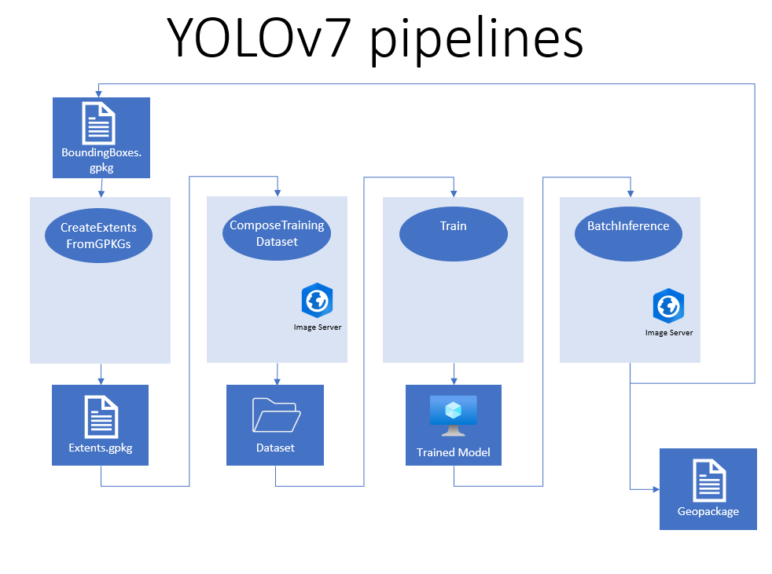

# Introduction 
This Git repository holds a project aimed at utilizing YOLOv7 and YOLOR algorithms for object detection in raster data within the context of GIS (Geographic Information System) data.
The project is focused on detecting and classifying objects within raster imagery in an efficient and accurate manner. This repository is a valuable resource for those interested in using YOLOv7 and YOLOR for object detection in GIS data.
This repository contains code for YOLOv7 and YOLOR. The code is based on the original YOLOv7 implementation by https://github.com/WongKinYiu/yolov7, and https://github.com/WongKinYiu/yolor.



There are 4 main pipelines that's need to be considered to be able to create a probability map:

1. **Create extents** - `CreateExtentsFromGPKGs.py`

   Extents in this context are square crop-outs of defined size, each centered in one of the provided training polygons. This helps to handle large geopackage files and reduce the training data into managable units of fixed size.

2. **Compose training dataset** - `ComposeTrainingDataset.py`

   In this step the pipeline will extract the specified geo-raster data from the provided apis and stores them as individual tiff-files for each square window (extent) extracted in the previous step. It also creates the bounding boxes txt files for these areas. A yolo dataset will have the structure `images` `labels` and `split`

   Make sure that the data.yaml's content is correct:

   ```
   train: datasets/path/split/train.txt
   val: datasets/path/split/val.txt
   
   nc: 1 #number of input channels
   names: [ 'other' ] #class names
   
   ```

   

3. **Train** - `Train.py`

   In this step the AI model will be trained on the dataset composed in the previous step. Different parameters can be used in the command or in the `configurations.json` file in the `configurations/` folder.

4. **Detection** - `BatchInference.py`

   After the training and the AI model performance has achieved the goal, the AI model can be used to create .gpkg files with bounding boxes and points. Setup the parameters to run Batch inference over a specified geographic area. BatchInference can be used to as a auto anotation aswell. Useful features like setting a large geographical offset for each image can be set to have a large geographical spread in the data.

# Getting Started
Clone the repository with `git clone https://tfs.skogsstyrelsen.se/SKS1/Skogsstyrelsen/_git/AIRaster-YOLOv7`

`cd AIRaster-YOLOv7`

Make sure to download the ssl certificate `cacert.pem` to be able to download data with a secured approach:

[SSL Certifikat i utvecklingsmiljöer - Overview (skogsstyrelsen.se)](https://tfs.skogsstyrelsen.se/SKS1/Skogsstyrelsen/_wiki/wikis/Skogsstyrelsen.wiki/281/SSL-Certifikat-i-utvecklingsmiljöer)

Clone the YOLOv7 repository `git clone https://github.com/WongKinYiu/yolov7.git`

or/and clone YOLOR repository `git clone https://github.com/WongKinYiu/yolor.git`

Clone the data processing repository inside the AIRaster-YOLOv7 directory  `git clone https://tfs.skogsstyrelsen.se/SKS1/Skogsstyrelsen/_git/AIRaster-dataprocessing`

##### Conda environment (currently only for Windows)

It is recommended to use docker instead of conda (see instructions in next section) to reduce the risk of compatibility issues. Still, it is possible to run the software with a Conda environment in Windows.

1. Create a new conda environment with python 3.8

2. Open a command prompt with the new conda environment activated

3. Go to the data processing directory

   ```
   cd AIRaster-dataprocessing
   ```

4. Install the package

   ```
   python -m pip install .
   ```

5. Go to the AIRaster-YOLOv7 root directory

   ```
   cd ..
   ```

6. Install gdal `conda install gdal`

7. Install fiona `conda install fiona`

4. Install the of the requirements `pip install -r windows_installation/requirements-38.txt`

##### Docker environment

Open a command prompt with docker available. If you are using WSL, move the `dockerfile` and `requirements.txt` to the disk space of WSL and build the docker image inside WSL file system. 

1. Copy the project to the WSL disk space

   ```
   cp -r <path>/AIRaster-AIRaster-YOLOv7 /home/AIRaster-YOLOv7
   ```

2. Go to the copied directory

   ```
   cd /home/AIRaster-AIRaster-YOLOv7
   ```

1. Start the docker service:

   ```
   service docker start
   ```

4. Start docker and build the image:

   ```
   docker build -t yolov7 .
   ```

   You might need to uncomment the section `#ENV REQUESTS_CA_BUNDLE cacert.pem` in the dockerfile to be able to install the packages.

1. When it's been built. Start the docker container

   Windows:

   ```
   docker run --gpus all -it -v ${pwd}:/mnt/ --shm-size=1024m mdpx /bin/bash
   ```

   If mlflow is available:

   ```
   docker run --gpus all -it -v ${pwd}:/mnt/ -v <path/to/mlflow>:/mnt/mlflow_tracking --shm-size=1024m yolov7 /bin/bash
   ```

   Linux:

   ```
   docker run --gpus all -it -v $(pwd):/mnt/ --shm-size=1024m mdpx /bin/bash
   ```

   If mlflow is available:

   ```
   docker run --gpus all -it -v $(pwd):/mnt/ -v <path/to/mlflow>:/mnt/mlflow_tracking --shm-size=1024m yolov7 /bin/bash
   ```

   

# Run pipelines
##### Extract extents
Extents can be described as bounding boxes contained in gpkg files. These specify the areas that are extracted from the different map layers which serves as input to the model. The extents are generated by enveloping some polygons (also a .gpkg file) in a square. This needs to be done as the model can only be trained on (regular) rectangular images.

To generate the extents, first download the polygon files that the extents will be created around. Each bounding box should have an attribute "class" which should represent the name of the object, for example `kolbotten`

When the polygon .gpkg files have all been downloaded, run the "CreateExtentsFromGPKGs.py" script to genreate extents around the polygon files.

###### Parameters:

--input_path: The directory that contains the polygons.

--ouput_path: The output path where the extents polygon should be stored.

--extent_size: The spatial size in meters for each extent (default = 1280).

```
python CreateExtentsFromGPKGs.py --input_path path/to/polygon/folder --ouput_path path/to/output/folder --convert_to_bbox
```

##### Compose Training Dataset

###### Parameters:

--extents: Path to extents directory.

--output_path: Destination path of the training dataset.

--configuration: Data configuration. Must be set to a parent key from the dict in `configuration/configurations.json`

 --img_size: The image resolution for the images.

--meters_per_pixel: the meters per pixel. The image_size and meters_per_pixel should correlate the the extent spatial size. i.e image_size*meters_per_pixel == extent_size

--classes: A list of the object classes. The order of the classes in this list will determine the yolo class index.


`configuration/configurations.json` contains the information for what type of data should be downloaded and how it should be normalized, an example call can look like this:

```
python ComposeTrainingDataset.py --output_path example_dataset --extents test_omrade_1 --configuration hillshade
```

##### Train

The `Train.py` is very similiar to YOLOv7's `train.py`. One important feature is that we include mlflow to be run when running `Train.py`.

```
python Train.py 
--cfg configurations/yolov7_configurations/1_class/yolov7-tiny_small_objects.yaml 
--data dataset/data.yaml 
--epochs 1 
--weights '' 
--device cpu 
--batch-size 2 
--img-size 128 128 
--hyp yolov7_configurations/1_class/hyp.scratch.p5_hillshade.yaml 
--mlflow 
--mlflow_path mlruns
```

If you are going to train with YOLOR instead of YOLOv7, run the file `TrainYolor.py` instead:

```
python TrainYolor.py 
--cfg configurations/yolor_configurations/1_class/yolor_p6_fangstgropar.cfg 
--data dataset/data.yaml 
--epochs 1 
--weights '' 
--device cpu 
--batch-size 2 
--img 128 128
--hyp configurations/yolor_configurations/1_class/hyp.fangstgropar.yaml
--mlflow 
--mlflow_path mlruns
```


##### Batch Inference

###### Parameters:

--coordinates: The area in which the model will predict on.

--img_size: Size of images to feed the model. Pixel per meter should be the same as in the training dataset.

--weights: The path to the model weight file.

--geo: The geographical size for each image.

--offset: The offset for each image. Should be set to 0 when running for production.

--conf-thres: The threshold for the detections to be valid.

--algorithm: Default set to YOLOv7. Set to yolor if that is you choice.

--yolor_cfg: Must be set when using YOLOR.

```
python BatchInference.py --coordinates 427700,6291100,498700,6492100 --geo 1280 --offset 10000 --img_size 256 --configuration hillshade --weights mlruns/artifacts/weights/best_211.pt --conf-thres 0.25
```

**Batch Inference on Docker Swarm**

The container has to be pushed to the Docker Swarm cluster.

You might need to change the url in `pipeline_utils/RestAPIs.py` to an accessable image server. PS. Make sure to set the parameter `--write_to_tmp` to be able to store the result on a network file share. Example command:

```
docker service create --constraint 'node.hostname==aitest01.svo.local' --restart-condition=none --name skelettskogar_inference_omrade_2_job1 --mount type=bind,source=/sksmnt/gemensam_ai/mlflow/,destination=/mnt/mlflow_tracking --mount type=bind,source=/sksmnt/gemensam_ai/skelettskogar_2022/output,destination=/mnt/output --mount type=tmpfs,dst=/dev/shm,tmpfs-size=1000000000 repoprod.svo.local:7443/ai/yolov7:latest /home/user/miniconda/bin/python BatchInference.py --geo 80 --img_size 512 --configuration ortofoto_1_1 --weights /mnt/mlflow_tracking/mlruns/379478389950724769/aa1e43f061d54e5e973835f3943e88f7/artifacts/weights/best_277.pt --conf-thres 0.25 --output /mnt/output --write_to_tmp --coordinates 500000,6550000,520000,6560000
```


# Contribute

- We would like to acknowledge the contributions of the original YOLOv7 authors and the Ultralytics team for their work on the YOLOv7 algorithm. Without their contributions, this repository would not be possible. We would also like to aknowledge the contributions of the original YOLOR authors for their work on the YOLOR algorithm. Without their contributions, this repository would not be possible.